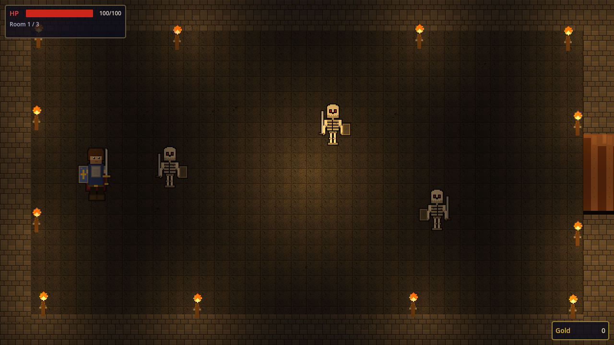
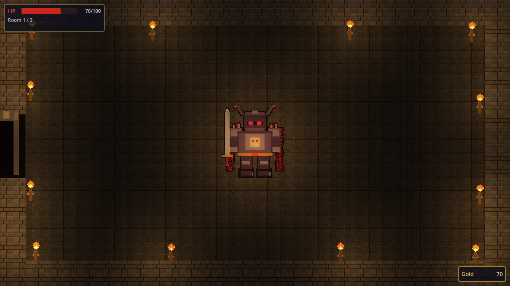
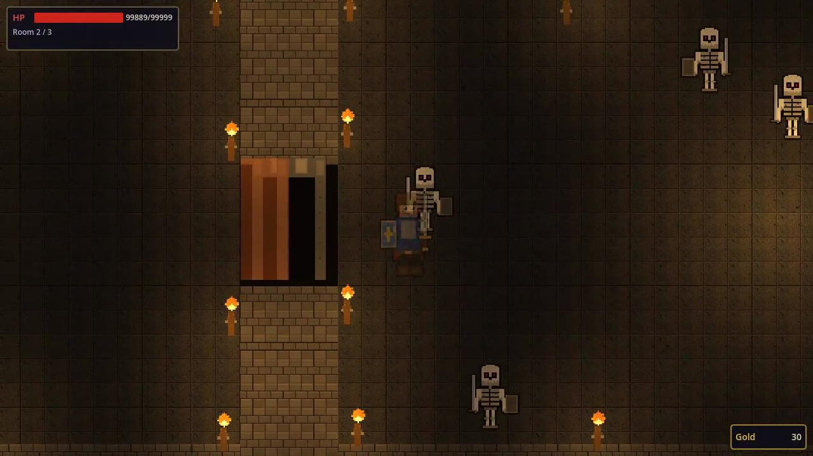
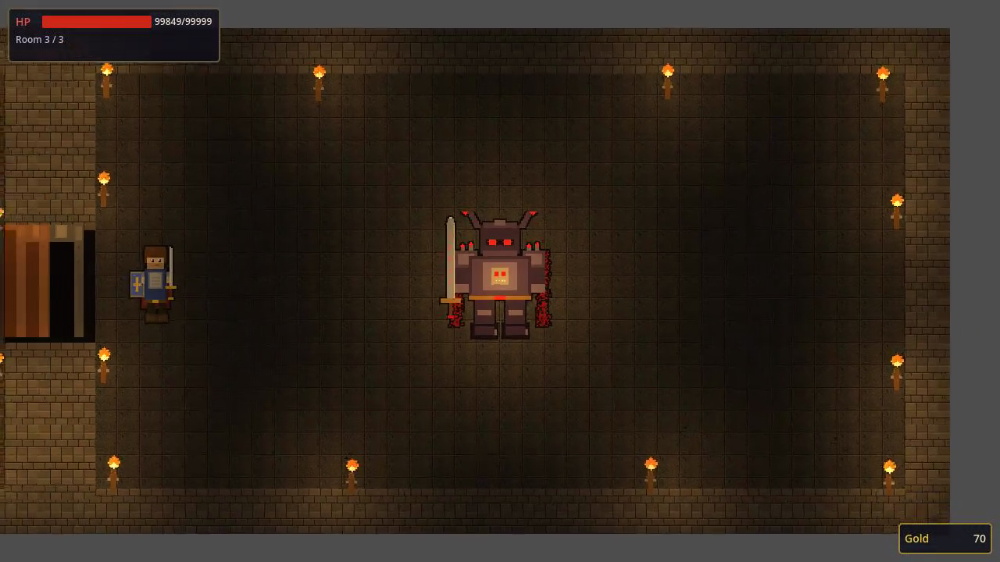

# Dungeon Blade

Dark fantasy pixel art top-down action game. Fight through skeleton-filled dungeon rooms with your sword and defeat the boss.

Built with [Godot Engine 4.6](https://godotengine.org/) and [godogen](https://github.com/htdt/godogen) (AI game generation pipeline).

## Gameplay


## Screenshots

| Room 1 - Skeleton Battle | Boss Fight |
|:---:|:---:|
|  |  |

| Room 2 - Skeleton Swarm | Boss Battle |
|:---:|:---:|
|  |  |

## How to Play

### Controls

| Action | Key |
|--------|-----|
| Move | WASD / Arrow Keys (8-directional) |
| Attack | Space / Left Click |

### Objective

Clear 3 dungeon rooms to win:

1. **Room 1** — Defeat 3 skeleton enemies to open the door
2. **Room 2** — Defeat 4 skeleton enemies to open the door
3. **Room 3** — Defeat the boss

### Tips

- Stand still for 3 seconds to regenerate HP
- Taking damage resets the regen timer
- If you die, the game auto-retries after 1 second
- Gold drops from defeated enemies

## Boss Fight

The boss has 300 HP, a charge attack, and an area slam. Watch for telegraphs and dodge!

## Running

Requires [Godot 4.6+](https://godotengine.org/).

```bash
# Open in Godot editor
godot --path .

# Or run directly
godot --path . --quit-after 0
```

Press F5 or the Play button in the editor to start.

## Built With

- [Godot Engine 4.6](https://godotengine.org/)
- [godogen](https://github.com/htdt/godogen) — AI game generation pipeline
- Procedural pixel art assets
